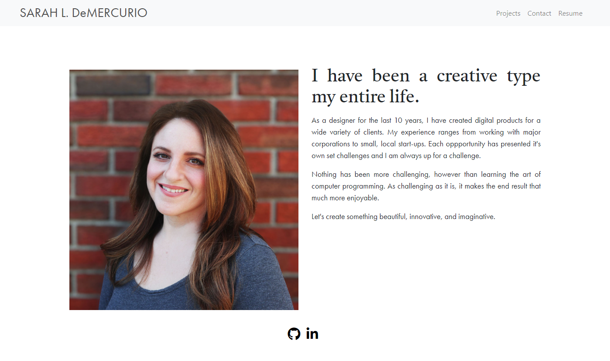
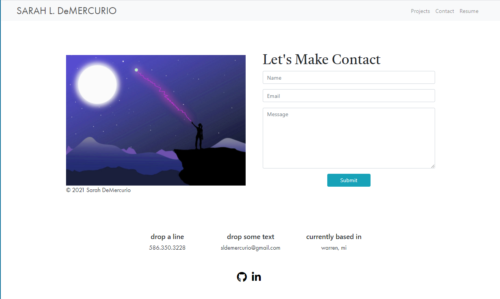
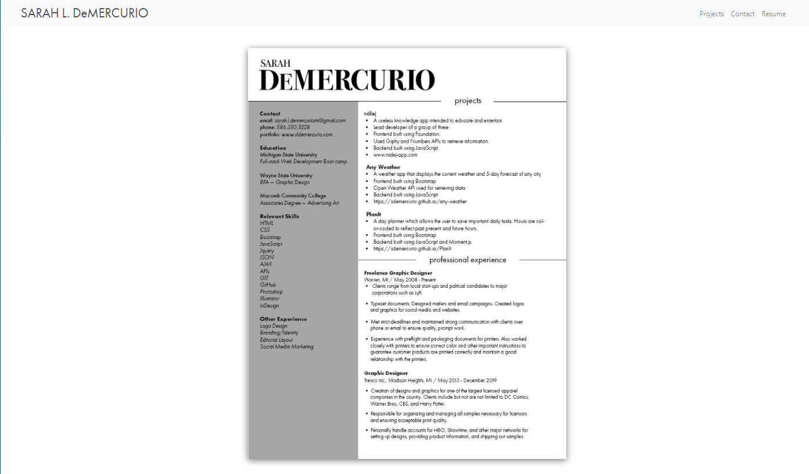

# Updated Portfolio for Sarah L DeMercurio
> For this project, I was required to update my portfolio created during week 2 of the program. 

## Table of contents
* [General info](#general-info)
* [Screenshots](#screenshots)
* [Technologies](#technologies)
* [Status](#status)

## General info
The portfolio is to be mobile-first and display my first project as well as 2 other homework assignments, with links to the deployed pages and GitHub repositories. My contact information has been updated and there are now links to my GitHub page as well as LinkedIn.

Now that I have created a number of projects, I would reconsider having severl html files and instead, have the user scroll down through the page, or get a little more creative with it.

## Screenshots

## Technologies
* Bootstrap 4
* Javascript
* Jquery

## Status
Project is: _in progress_
This is a project I expect to continuously build and improve on throught the course of the program.

Link to deployed page: https://www.sldemercurio.com/
Link to repository: https://github.com/sdemercurio/demercurio-portfolio.git
Link to LinkedIn profile: https://www.linkedin.com/in/sarah-demercurio-a8507517/

