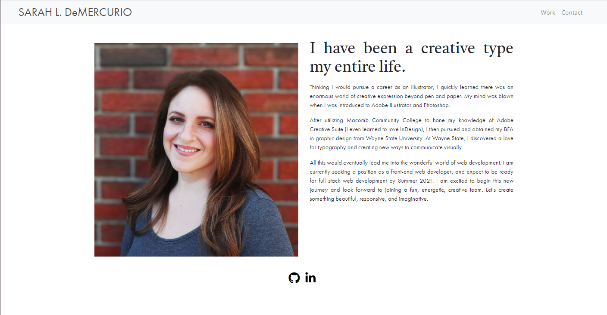

# Responsive Portfolio for Sarah L DeMercurio
> For this project, I was required to create a mobile-first responsive portfolio using Bootstrap.

## Table of contents
* [General info](#general-info)
* [Screenshots](#screenshots)
* [Technologies](#technologies)
* [Status](#status)

## General info
The Navbar was to be consistent on each page with working links to the Portfolio (Work) and Contact pages.
Using semantic html was a must, as well as validating the html.s Lastly, we were required to include our personal information ie. social media links, pictures, etc.

## Screenshots
### About Me/Home

### Portfolio/Work

### Contact

## Technologies
* Bootstrap 4

## Status
Project is: _in progress_
This is a project I expect to revise and build upon throughout the course of this program.

Link to deployed page: https://sdemercurio.github.io/demercurio-portfolio/

